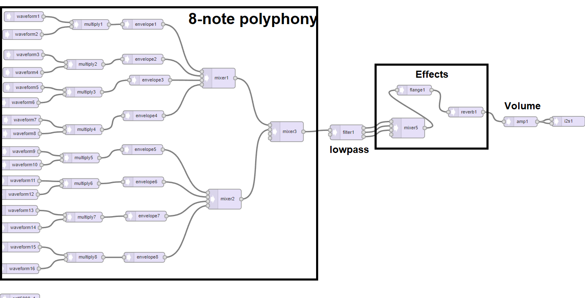

## Ports

Potentiometer ports
Volume: A1
Frequency: A21
Resolution: A24

Attack: A10
Decay: A23
Sustain: A11
Release: A22

Button ports
42, 41, 54, 56, 57

Keyboard ports
Input: 32, 31, 30, 29, 28, 27, 26, 25
Power: 46, 33, 34, 35, 36, 37, 38, 39

Waveform list:
Sine, Sawtooth, Square, Triangle

## Patch characteristics

The synthesizer has 8 possible envelopes through which to play sound, and two waves on each envelope which are combined through a multiplication step (Ring modulation). The sounds are combined through a mixer and passed through a low-pass filter, then flanger, then a reverb module, in that order. The output is modulated by the volume knob and passed to the teensy's audio output.

## Keyboard characteristics

The keyboard itself has 36 keys, but the wiring configuration allows for reading from 64 potential keys (the remainder after the initial 36 are dead inputs). Keys are organized in groups of 8. To read from a group, power is passed through that group's power pin, the inputs are retrieved from the 8 input pins, and then power is switched off. Inputs can only be read in whole groups, so power must be passed through multiple power pins in order to read the whole keyboard.

Ideas for extension:
- Link phase of each oscillator to a pot
- Link envelope to cutoff of a filter?
   